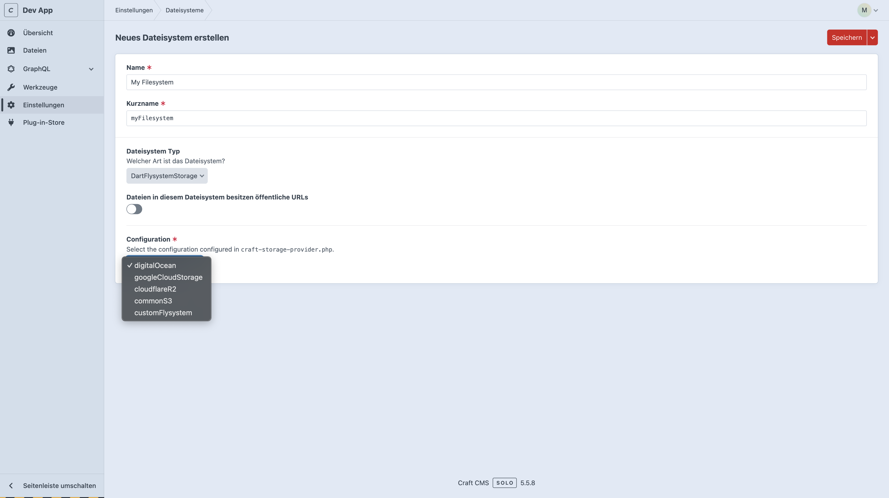

# Craft Flysystem Storage

> ⚠️ WARNING: Alpha-Version!

A Craft CMS plugin that provides a flexible file storage system per environment. It allows you to use different storage solutions depending on the environment, such as local file storage during development and Amazon S3 in production. Additionally, any Flysystem adapter can be integrated directly into Craft CMS without requiring further configuration. This ensures seamless adaptability to a variety of storage solutions, making it easy to tailor the setup to specific project needs or infrastructure requirements. The plugin streamlines the process of managing file storage across environments, enhancing workflow efficiency and scalability.

## Features

- **Environment-Specific Storage**: Store files locally or in the cloud (e.g., S3) depending on your environment.
- **Seamless Craft CMS Integration**: Easy to integrate into existing Craft projects.
- **Flexible and Extensible**: Customizable for various storage requirements.

## Available Adapters

| Adapter                | supported   | clear cache |
|------------------------|-------------|-------------|
| Cloudflare - R2        | ✅           | ❌ (planned) |
| Cloudflare - Stream    | ❌ (planned) | -           |
| AWS S3                 | ✅           | ❌ (planned) |
| DigitalOcean Spaces    | ✅           | ❌ (planned) |
| FTP                    | ✅           | ❌ (planned) |
| Google Cloud Storage   | ✅ (planned) | ❌ (planned) |
| All Flysystem Adapters | ✅           | -           |

---

## Installation

### Install:  
`composer require dartdigital/craft-flysystem-storage`

### Config

Add the configuration file `craft-storage-provider.php` to the `config` folder.

This configuration file defines the storage adapter for the Craft Storage Provider plugin. It supports multiple environments, allowing for flexible storage solutions such as using local storage in development and Amazon S3 in production.

The names of the adapterConfigs can be freely chosen. They only need to be selected in the Craft CMS backend.


#### craft-storage-provider.php
```
// config/craft-storage-provider.php
<?php

use craft\helpers\App;
use Dart\Library\Craft\StorageProvider\Adapter\CloudflareR2Adapter;
use Dart\Library\Craft\StorageProvider\Adapter\DigitalOceanS3Adapter;
use Dart\Library\Craft\StorageProvider\Adapter\FlysystemAdapter;
use Dart\Library\Craft\StorageProvider\Adapter\GoogleCloudStorageAdapter;
use Dart\Library\Craft\StorageProvider\Adapter\LocalAdapter;
use Dart\Library\Craft\StorageProvider\Adapter\S3Adapter;
use Google\Cloud\Storage\StorageClient;
use League\Flysystem\Ftp\FtpConnectionOptions;
use League\Flysystem\Ftp\FtpAdapter;

return [
    '*' => [
        'adapterConfigs' => [
            #'<anyName>' => new <*>Adapter(
            #    any Adapter which extends craft\flysystem\base\FlysystemFs
            #    [...]
            #),
            'digitalOcean' => new DigitalOceanS3Adapter(
                accessKeyId: App::parseEnv('$DIGITAL_OCEAN_KEY_ID'),
                secretAccessKey: App::parseEnv('$DIGITAL_OCEAN_SECRET_ACCESS_KEY'),
                region: App::parseEnv('$DIGITAL_OCEAN_REGION'),
                bucket: App::parseEnv('$DIGITAL_OCEAN_BUCKET'),
            ),
            'googleCloudStorage' => new GoogleCloudStorageAdapter(
                storageClient: new StorageClient([
                    'projectId' => App::parseEnv('$GOOGLE_CLOUD_STORAGE_PROJECT_ID'),
                    'keyFilePath' => App::parseEnv('$GOOGLE_CLOUD_STORAGE_KEY_FILE_PATH'),
                ]),
                bucket: App::parseEnv('$GOOGLE_CLOUD_STORAGE_BUCKET'),
            ),
            'cloudflareR2' => new CloudflareR2Adapter(
                accountId: App::parseEnv('$CLOUDFLARE_R2_ACCOUNT_ID'),
                accessKeyId: App::parseEnv('$CLOUDFLARE_R2_ACCESS_KEY_ID'),
                secretAccessKey: App::parseEnv('$CLOUDFLARE_R2_SECRET_ACCESS_KEY'),
                bucket: App::parseEnv('$CLOUDFLARE_R2_BUCKET'),
                eu: App::parseBooleanEnv('$CLOUDFLARE_R2_EU_ENABLED'),
            ),
            'commonS3' => new S3Adapter(
                args: [
                    'endpoint' => App::parseEnv('$S3_HOST'),
                    'use_path_style_endpoint' => App::parseBooleanEnv('$S3_USE_PATH_STYLE_ENDPOINT'),
                    'credentials' => [
                        'key' => App::parseEnv('$S3_KEY'),
                        'secret' => App::parseEnv('$S3_SECRET'),
                    ],
                ],
                bucket: App::parseEnv('$S3_BUCKET')
            ),
            'customFlysystem' => new FlysystemAdapter(
                # use all Flysystem Adapters here or write your own 🥳: https://flysystem.thephpleague.com/docs/
                # filesystemAdapter: new League\Flysystem\Local\LocalFilesystemAdapter('/var/www/html/web/local')
                # filesystemAdapter: new League\Flysystem\InMemory\InMemoryFilesystemAdapter();
                filesystemAdapter: new FtpAdapter(
                    FtpConnectionOptions::fromArray([
                        'host' => App::parseEnv('$FTP_HOST'),
                        'root' => App::parseEnv('$FTP_ROOT'),
                        'username' => App::parseEnv('$FTP_USERNAME'),
                        'password' => App::parseEnv('$FTP_PASSWORD'),
                        'port' => (int)App::parseEnv('$FTP_PORT'),
                    ])
                )
            ),
        ],
    ],
    'dev' => [
        'adapterConfigs' => [
            'digitalOcean' => new LocalAdapter(
                location: App::parseEnv('$LOCAL_STORAGE_LOCATION') . '/digitalOcean'
            ),
            'googleCloudStorage' => new LocalAdapter(
                location: App::parseEnv('$LOCAL_STORAGE_LOCATION') . '/googleCloudStorage'
            ),
            'cloudflareR2' => new LocalAdapter(
                location: App::parseEnv('$LOCAL_STORAGE_LOCATION') . '/cloudflareR2'
            ),
            'commonS3' => new LocalAdapter(
                location: App::parseEnv('$LOCAL_STORAGE_LOCATION') . '/commonS3'
            ),
            'customFlysystem' => new LocalAdapter(
                location: App::parseEnv('$LOCAL_STORAGE_LOCATION') . '/customFlysystem'
            ),
        ],
    ],
];
```

#### .env
```
# DigitalOcean
DIGITAL_OCEAN_BASIS_URL=
DIGITAL_OCEAN_KEY_ID=
DIGITAL_OCEAN_SECRET_ACCESS_KEY=
DIGITAL_OCEAN_REGION=
DIGITAL_OCEAN_BUCKET=

# GoogleCloudStorage
GOOGLE_CLOUD_STORAGE_BASIS_URL=
GOOGLE_CLOUD_STORAGE_PROJECT_ID=
GOOGLE_CLOUD_STORAGE_KEY_FILE_PATH=
GOOGLE_CLOUD_STORAGE_BUCKET=

# Cloudflare R2
CLOUDFLARE_R2_BASIS_URL=
CLOUDFLARE_R2_ACCOUNT_ID=
CLOUDFLARE_R2_ACCESS_KEY_ID=
CLOUDFLARE_R2_SECRET_ACCESS_KEY=
CLOUDFLARE_R2_BUCKET=
CLOUDFLARE_R2_EU_ENABLED=

# CommonS3
S3_BASIS_URL=
S3_HOST=http://minio:9000
S3_USE_PATH_STYLE_ENDPOINT=true
S3_KEY=
S3_SECRET=
S3_BUCKET=

# FTP
FTP_BASIS_URL=
FTP_HOST=
FTP_ROOT=
FTP_USERNAME=
FTP_PASSWORD=
FTP_PORT=
```

### Craft CMS - Setup

- Create new Filesystem
- Select `DartFlysystemStorage` as type.
- Choose a Configuration from `./config/craft-storage-provider.php`



# Plugin Development

Prerequisites
- Docker Compose: To set up a simple local development environment.

## Setup

Follow these steps to set up the local development environment:

```
docker compose --profile dev up
docker compose exec webserver composer install

docker compose exec webserver cp .env.example.dev .env

docker compose exec webserver php craft setup/app-id
docker compose exec webserver php craft setup/security-key

docker compose exec webserver php craft setup # Configure all default values.
```

Open:
http://localhost

## Minio (S3) Setup

Go to: http://localhost:9001/login
Username: admin
Password: minio-admin

- create Bucket
- create Access Key
- make Bucket public available

## Testing Plugin Changes

Make changes to the code in the src directory. Run the following command to reflect the changes in the CMS:

```
docker compose exec webserver composer update
```

# Support

If you have any questions or encounter issues, please open an Issue in this repository! 🎉
